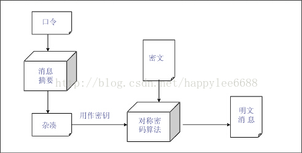

#### :snail: Core java
 ####  Collection类
 #####  List
 ######  在list对int元素去重
 	- list去重  可以通过hashSet不允许重复元素，不保证添加顺序，LinkedHashSet不允许有重复元素但是 可以保证添加顺序
 	- list去重  通过创建一个新的list  通过比对新的数组是否已经放入了这个元素 ，如果已经有了就不放入；另外就是对过比对值如果相等 删除其中一个
 ###### 泛型的使用
 ###### list中含有一个person类中有int age,String name,现在按照age进行升序排序
 ###### list中含有一个person类中有int age,String name,现在按照age进行升序排序，age大小相同，按照name排序
 ###### list转数组的应用。
     list.toArray();
 ######  Arraylist我想固定他的固定容量可以吗，怎么固定？
   List list=Arrays.asList("11","333");//定长 不能添加和删除
 ###### Arraylist是如何自动增加长度的，代码是怎么实现的。

     arrayList是基于数组的，arrayList有一个带参数的构造函数，参数的意思是他的长度，默认的长度是10.当数据多的时候，list会增加长度，
     newLength=oldlength+oldLength/2;所以依次长度为10,15 22,33,49........,新的数组增加长度后，然后将旧的数组的数据拷贝到新的数组里面，
     这就是ArrayList基于数组增加长度的原理。

     int newCapacity=oldCapacity+(oldCapacity>>1)//扩容
     elementData=Arrays.copyOf(elementData,newCapacity);//复制元素

 ###### 一个Arraylist怎么复制到另外一个arrayList？
     list.addAll(list1);
 ######  list与vector区别？
   - vector是分配的一块连接的地址空间，所以对vector元素进行随机访问效率高，不过对其元素进行增加和删除，需要对现有元素进行复制，移动。如果vector储存中的存储对象很大，
     那么对现有元素进行拷贝的开销就回很大。
   - list中的对象是离散存储的，随机访问元素是需要遍历list。在list中插入，删除叶黄素，有钱是在尾部插入原始，效率很高，只需要改变元素的指针。
   - 他们最大的区别是vector是单向的，和数组类似。list数据结构是双向链表，是双向的。

    #####  HashMap
    ######  核心源码的提问
     默认的容量是16，最大的1<<30,加载的因素：0.75f;

    -  哈希表是一种散列表，是一种非常重要的数据结构，应用场景及其丰富，许多缓存技术（eg:memcached）的核心其实就是维护一张大的哈希表。

    - **数组**：采用一段连续的存储单元来存储数据。对于指定下标的查找，时间复杂度为O(1)；通过给定值进行查找，需要遍历数组，逐一比对给定关键字和数组元素，时间复杂度为O(n)，当然，对于有序数组，则可采用二分查找，插值查找，斐波那契查找等方式，可将查找复杂度提高为O(logn)；对于一般的插入删除操作，涉及到数组元素的移动，其平均复杂度也为O(n)

    - **线性链表**：对于链表的新增，删除等操作（在找到指定操作位置后），仅需处理结点间的引用即可，时间复杂度为O(1)，而查找操作需要遍历链表逐一进行比对，复杂度为O(n)

    - **二叉树**：对一棵相对平衡的有序二叉树，对其进行插入，查找，删除等操作，平均复杂度均为O(logn)。

    - **哈希表**：相比上述几种数据结构，在哈希表中进行添加，删除，查找等操作，性能十分之高，不考虑哈希冲突的情况下，仅需一次定位即可完成，时间复杂度为O(1)，接下来我们就来看看哈希表是如何实现达到惊艳的常数阶O(1)的。
   我们知道，数据结构在物理存储结构只有两种：顺序存储结构和链式存储结构（像栈，队列，树，图等是从逻辑结构去抽象的，映射到内存中，也这两种物理组织形式），而在上面提到数组下标查找某个元素是一次定位可以达到的。
   hash table就是利用这个特性，hash table主干是数组。

   hash 函数的计算的重要性涉及到hash冲突的比例，尽可能保证计算简单和散列地址分别均匀。
   hashMap采用了链地址法：数组+链表的方式（hashmap的主干是一个entry[]数组，entry是hashmap的基本组成单位，每一个entry包含一个key-value键值对）
    

    计算数组的下标：index=h&(length-1);---------例如说hash值为18，length=16来计算下标
    hashmap的数组长度一定要为2的次幂，尽量减少地址冲突。
    ###### 与HashSet的区别
         - hashSet不允许出现重复元素，无序的，不是按照插入内容进行排序（存储对象之前比较hashcode().equal()或者利用add()判断是否能添加元素）；
         - hashmap实现了map接口，map接口对键值对进行映射。map不允许出现重复的key，map接口有两个基本实现treemap，hashamp。treemap保存了对象的排列次序。
         而hashmap不能，hashmap可以有空的键值对，hashmap是非线程安全的
         - hashmap是调用put添加元素，hashset是调用add来添加元素
         - hashmap是利用key来进行计算hash，hashset利用对象来计算hash
         - hashmap是存储键值对，hashset仅存储对象。
         - hashmap相对于hashset较快，因为它是使用唯一的键获取对象。

    ######  对HashMap如何排序？

   将元素遍历出来放入到list,然后通过list进行排序

    ######  线程安全的问答
    hashMap是线程非安全的，如果想线程安全需要在方法里面添加synchronize关键字。

    #####  Set
    ######  TreeSet排序
        利用compartor进行排序；
    ######  HashSet与hashMap区别

    ######  HashSet的核心源码
    hashset是基于hashmap实现的，操作更简单，更像是对hashmap做了一次“封装”，而且只使用了hashmap的key进行实现各种特性
    #####  LinkList
    ######  linklist是由双向链表实现的（其中每个对象都包含数据的同时还指向链表的前一个和后一个元素的引用），它实现了list，能进行队列操作。
    ArrayList底层是数组支持。
    ######  什么情况下你会使用ArrayList？什么时候你会选择LinkedList？
     arrayList与linkedlist本质区别是数组和列表的两种数据结构的区别：ArrayList使用的内存量更大一些，在随机访问的效率高，删除，添加元素效率低。linkedlist刚好相反。

    ##### iterator
    ###### for循环中怎么使用iterator
     一般arraylist linkedList可以使用for

    ###### while循环中怎么使用iterator
        while(iterator.hashNext()){}

    ###### ListIterator与Iterator的区别
      都是迭代器，当需要对集合进行遍历的时候不需要干涉遍历过程。
      - iterator可以对所有的集合进行遍历，listiterator只能对list和其子类进行遍历；
      - listiterator有add方法可以在当前引用下添加元素，iterator不能添加元素；
      - listiterator可以向前向后遍历，iterator只能向后遍历；
      -
    ##### 泛型
    ###### Java中的泛型是什么 ? 使用泛型的好处是什么?
    - 类型安全
    - 消除强制类型转换；
    - 潜在的性能收益（多态）

    ###### Java的泛型是如何工作的 ? 什么是类型擦除 ?
         List<String> list=new ArrayList<String>();
         List<Interger> list1=new ArrayList<Integer>():
         list.getClass==list1.getClass();两者相等，将类型信息擦除了，这就是所谓的类型擦除。
    ###### 什么是泛型中的限定通配符和非限定通配符 ?
      限定通配符有两种
      - <? extends T>类型必须是T或者他的子类；
      - <? super T> 类型必须T或者他的父类；
      非限定通配符是类型 <T> ,可用任何类型代替；

    ###### List<? extends T>和List <? super T>之间有什么区别 ?
    ###### 如何编写一个泛型方法，让它能接受泛型参数并返回泛型类型?
    ###### Java中如何使用泛型编写带有参数的类?
    ###### 你可以把List<String>传递给一个接受List<Object>参数的方法吗？
    ###### Array中可以用泛型吗?
    ###### 如何阻止Java中的类型未检查的警告?
      这种警告可以使用@SuppressWarnings("unchecked")注解来屏蔽。

    ##### 线程
    ###### extend Thread和implements Runnable的区别及使用
    这个其实就是继承和实现接口的区别
    - 实现接口可以另外再继承其他类，继承只能继承一个类
    - 实现接口的编程会稍微复杂点，如果需要访问当前线程需要 Thread.cuurrentThread()，继承线程，只需要用this即可获取当前线程
    ###### 为什么我们调用start()方法时会执行run()方法，为什么我们不能直接调用run()方法？
         因为如果我们直接调用子线程的run方法，那么这个方法其实还是运行在主线程中的，我们只有在子线程开始后，才能子线程才能执行run方法。

    ###### 使用匿名类来运行线程

    ###### 如何得知一个线程运行完毕？
   run()函数内容执行完毕，或者用isAlive()来判断；

    ###### 我需要有一个变量用于记录某个线程运行从开始到结束一共用了多少时间？

    ###### 线程锁的问答：synchronized和lock的使用（必须2个都知道）

    ###### synchronized的用法

    ###### synchronized method

    ###### synchronized static method是怎么样？和synchronized method的区别在哪？
        synchronized method 的同步对象是指类实例对象，

        synchronized static method 的同步对象指类本身，也就是所有对象共享这个同步对象。

    ###### synchronized{}段

    ###### synchronized(obj)

    ###### 这边这个synchronized(obj)里的obj是个什么东西？
    当前对象

    ###### lock怎么用？lock(obj)时这个obj怎么声明你认为最好？

    ###### future有没有用过？Lazy Future？ Promise？可复用的Future？ Callable是什么，和Future的区别？
      - lazy future:与一般的future不同，lazy future在创建之初不会准备引用的对象，而是等到请求对象时才开始工作。
      本身并不是为了实现并发，而是节约不必要的运算资源为出发点。例如设计某些API的时候需要回一组信息，但是其中某些信息的计算会耗费可观的资源，单是的调用者不一定关系所有的这些信息。
      因此那些需要耗费比较多资源的原始以lazy future形式提供，节约资源。lazy future可以避免过早的引用或锁定资源而产生的不必要的互斥。
      - promise 可以看作是future的一个特殊分支，常见的future一般是由服务调用者致敬触发的异步处理流程（这就像淘宝的订阅生产者和消费者，消费者去主动订阅而消费），promise显式表示那些异步流程并不直接由服务器触发情景。
       promise接口多一个set()或fulfill()接口。
      - 可复用的future：常用的future是一次性 的，当获取异步的结果，就失去了意义，但是经过特殊处理的future也可以实现复用
      ，这对于可多次变更的数据显得非常有用。例如淘宝的分布式订阅框架提供的future，它允许多次调用waitnext()方法（相当于future.get()方法），每次调用是否阻塞取决于是否又有数据发布，或者更新，如果没有数据更新，那么阻塞移植到
      下一次数据发布。
      -  callable与future都可以获取线程执行的结果，callable一般是与ExecutorService配合使用。
        future就是对具体的runnable或callable任务的执行结果进行取消，查询是否完成，获取结构。必要时可以通过get方法获取执行结构，该方法是阻塞的直到任务返回结果。
         callable定义的方法是call，

    ###### jdk1.5后新增的ConCurrent用过吗？
         java.util.concurrent

    ###### 什么是Executors框架？
      ThreadPoolExecutors框架的一个主要实现类，是执行具体任务的实现类。该实现类有executor中的工厂类executors提供的静态工厂方法负责创建。

    ###### 什么是阻塞队列？如何使用阻塞队列来实现生产者-消费者模型？

    ##### Subtopic

    ##### ConcurrentHashMap
  - 利用的锁分段技术增加了锁的数目，从而使争夺一般锁的线程数目得到有效的工作。hashmap在并发线程中使用可能导致死循环，因为插入的过程不是原子操作，
   每个hashentry是一个链表结构，很可能在插入的过程中，已经设置了后节点，实际还未插入最终反而插入到后节点之后，造成了
   链中出现了环，破坏了链表的性质，失去了为节点，出现死循环。
   hashtable因为内部采用了synchronize来保证线程的安全，但是在线程竞争激励的情况下hashtable的效率下降很快，多个线程竞争一个锁导致大量线程处于轮询或者阻塞。

   - concurrenthashmap 的get方法是无需要加锁的，因为用到的共享变量都采用了volatile关键字，保证了共享变量在线程之间的可见性
   - concurrentHashMap 是由segment数组和hashentry数组组成。segment是重入锁（ReentranLock）,作为一个数据段的竞争锁，每个hashentry一个链表结构的元素，
   利用hash算法得到索引确定归属的数据段，也就是对应到修改时需要竞争获取的锁。（eg:读取配置文件的时候，因为配置内容是共享的，为了线程安全且减少线程之间的竞争，可以用concurrentHashMap来读取内容）

   - segment的put操作是加锁的，在插入的时候先判断segment里的hashentry数组是否会超过容量（threshold），如果超过需要对数组进行扩容，翻一倍。然后
   在新的数组中重新hash,为了高效，concurrentHashMap只会对需要扩容的单个segment进行扩容。

    ##### Thread.start ()与 Thread.run ()有什么区别？
     - start启动线程，这个时候线程处于就绪状态，一旦得到cup时间片，就开始执行run方法，run方法称为线程提，包含 了这个线程需要执行的内容，run方法执行结束，这个线程也随之结束。
     - run方法只是一个类的普通方法，直接调用run，程序中依然只有一个主线程这一个线程，其程序执行还是需要顺序执行，run方法执行完毕往下执行。
        **总结**：调用start方法是可以启动线程，而run方法只是thread的一个普通的调用，还是在主线程里面执行。把需要并行处理的代码放在run方法中，start方法启动线程将自动调用run方法，这是由jvm
        的内存机制规定的。并且run方法必须是public访问权限，访问值类型为void
    ##### 什么是线程池（thread pool）
        线程池就是提前创建若干个线程，若干有任务需要处理，线程池里面的线程就回处理任务，处理完后线程不被销毁，而是放到线程池里面等待下一个任务。

    ###### 常用的线程池有哪些？
    newFixedThreadPool定长线程池. newScheduledThreadPool定时延迟执行线程池,new CachedThreadPool线程池的大小基本上没有限制，因为很大.newSingleThreadPool默认长度线程池

    ###### 如果回答出了至少fixedThreadPool(常用, SingleThreadExecutor的话进而问:

    ###### newSingleThreadExecutor用法

    ###### newSingleThreadExecutor用法

    ###### newFixedThreadPool用法

    ###### newScheduledThreadPool用法

    ###### newCachedThreadPool用法

    ###### 现在有T1、T2、T3三个线程，你怎样保证T2在T1执行完后执行，T3在T2执行完后执行？

    ###### 你将如何使用thread dump？你将如何分析Thread dump？
        thread dump 是非常有用的诊断java的应用问题工具，每一个java虚拟机都有及时生成所有线程的在某一点状态的thread-dump的能力，各个java虚拟机都提供了当前活动线程的快照，虽然微有不同。
        当前活动的快照，及jvm中所有java线程的堆栈跟踪信息，堆栈信息一般包含了完整的类名及所执行的方法，如果可能的话
        还有源码的行数。它的特点：
        - 能在各种操作系统下使用
        - 能在各种java应用服务器上使用；
        - 可以在生产环境下使用不影响性能；
        - 可以将问题直接定位到应用程序的代码行上；
        **thread-dump能诊断的问题：**
        - 查找内存泄漏，常见的程序里load大量数据到缓存；
        - 发现死锁的线程；
        **thread dump 最常用的两种方式**
        thread dump能帮助我们判断CPU峰值，死锁，内存异常，应用反应迟钝，响应时间变长和其他系统问题。
        - jstack :是一个抓取thread dump文件有效的命令行工具，位于jdk目录bin文件，抓取的密令：jstack -l <pid> > <file-path>
           eg: jstack -l 37320 > /opt/tmp/threadDump.txt

        -  kill -3 ：处于安全考虑，有一部分生产机器的环境值包含jre环境，因此就不能使用jstack工具了。这种情况使用kill -3； kill -3 <pid>;

    ##### 加密解密数字签名（高级如果连这个的“概念”都不知道，无法定高级）

    ###### 基与MD5或者SHA怎么做？
    - md5加密生产32位的md5码，速度非常快，性能高，安全前度比sha1低；
    - sha加密生产40位的sha码，加密速度比md5慢，性能比md5d低，安全强度比MD5高
     ** MD5和SHA1属于弱hash或者已经被破解的哈希算法。使用强哈希算法BCrypt**
     加密是单向的例如个人密码，不需要被其他人知道，所以不需要解密，如果用BASE64类似这种编码格式，就存在解码的风险，所以是建议用哈希算法这种加密方式。

    ###### BASE64是什么？和MD5的区别
      base64是常见的一种传输8字节的编码方式之一，base64是一种基于64个可以打印的字符来表示二进制数据的方法，base64编码是从二进制到字符的过程。
      md5加密是对任意长度的数据使用md5哈希算法散列为4个32位组，若格式化为ASCII字符则为16字符。若格式化16进制表示，则为32字符。

    ###### 对称和非对称加解密
    - 对称加密指的是加密和解密用的是同一个密钥，所以叫做对称加密。对称加密只有一个密钥，作为私钥。常见的对称的加密算法：
    AES ,DES,3DES等等。
    - 非对称加密指的是：加密和解密使用不同的密钥，一把作为公开的公钥，一把作为私钥。公钥加密的信息，只有私钥才能解密。私钥加密的信息只有公钥才能解密。常见的非对称加密算法：RSA,ECC
      对称加密的算法相对于非对称来说效率要高很多，但是缺陷是相对于密钥的管理上，以及在非安全的通信中，不安全。所以在实际网络中会将两者混合使用。
      例如正对C/S模型
      1.服务器计算一对密钥 pub/pri，将私钥保密，将公钥公开；
      2.客户端对服务器进行访问时拿到服务器的公钥；
      3.客户端通过AES计算出一个对称加密的密钥x.然后使用pub对x进行加密。
      4.客户端将加密后的文发送到服务端。服务端通过pri进行解密获取x;
      5.然后两边的通讯内容就通过对称加密x进行加减密。
    ###### 什么是三重DES(data entryption standard 数据加密标准 DES)
     对称的加密算法

    ###### 什么是RSA
    非对称的加密算法,公开公钥。

    ###### 扩展出什么时候用DES什么时候用RSA
      des是对称加密算法，相对于DES非对称算法来说，des算法速度处理快；DES密钥分配困难，而RSA简单，安全指数也更高。
    ###### 什么叫PBE？
    password based Entryption基于口令加密，其特点是使用口令代替了密钥，而口令由用户自己掌管，采用随机数杂凑多重加密等方法保证数据
    的安全性。
     **PBE加密流程**
      
      **PBE解密的原理图**
      
    ###### 常用的PBE有哪些？
    - PBEWithSHAAndDES
    - PBEWithSHAAndBlowfish
    - PBEWithSHAAnd128BitRC4
    - PBEWithSHAAndIDEA-CBC
    - PBEWithSHAAnd3-KeyTripleDES-CBC

    ###### 加密中的盐是什么用的？
     加盐加密是一种对系统登录口令的加密方式，它实现的方式是将每一个口令同一个叫做“盐”的随机数进行关联。

    ###### SecureRandom干什么用的？可以代替盐吗？
        这个类提供加密的强随机数生成器。收集了一些随机事件，比如鼠标点击，键盘点击等待，使用这些随机事件作为种子。这意味着，种子是不可预测的。不想random是默认使用系统
        当前时间作为毫秒数作为种子，有规律可寻。

    ###### 什么叫数字签名？
      数字签名能验证信息的完整性。数字签名是一个加密的过程，数字签名验证是一个解密的过程。
      数字签名是对非对称加密算法和数字摘要的技术的应用。

    ###### 我要做一个CA认证要做哪些工作 (PKI知识点）

    ##### String你用过吗？

    ###### 那StringBuffer用过吗？

    ###### String和StringBuffer的区别

    ###### 那StringBuilder用过吗？
     线程安全

    ###### 什么是可变类，什么是不可变类？（String不可变StringBuffer可变）
    final

    ###### 如果我要自己写一个类，使其不可变，这个类该怎么写，不用告诉我代码就告诉我一下这个类长什么样吧！

    ###### StringBuffer和StringBuilder的区别
    - 在运行速度来讲StringBuilder>StringBuffer>String;
    - StringBulider是线程非安全的，StringBuffer是线程安全的里面带有synchronize关键字。

    ##### 序列化是作什么用的？
    简单来说就是为了保存内存中的各种对象的状态，并且可以把保存的对象再度读出来。用来处理对象流的机制，所谓对象六也就是将对象的内容进行流化（i/o），

     ###### 一定要序列化吗？如果不序列化会有什么后果？
    一般需要序列化的情况：
    - 当你想把内存的 对象保存到一个文件 fileOutputStream或者数据库中；
    - 当你想用套接字在网络中传送对象的时候；
    - 当你想通过RMI传输对象的时候；

     ###### serialVersionUID的作用
    用于java序列化的机制。简单来说java的序列化机制是通过判断类的serialversionUID来验证一致性，jvm会把传来的字节流中的
    serialVersionUUID与本地的实体类的进行比较，如果一致，可以进行反序列化，否则就会出现序列化版本不一致的异常。

     ###### 如何生成serialVersionUID？随机还是1L，区别呢？
    随机的好处是：Client 端通过 Façade Object 才可以与业务逻辑对象进行交互。而客户端的 Façade Object 不能直接由 Client 生成，而是需要 Server 端生成，
    然后序列化后通过网络将二进制对象数据传给 Client，Client 负责反序列化得到 Façade 对象。该模式可以使得 Client 端程序的使用需要服务器端的许可，同时 Client 端和服务器端的 Façade Object 类需要保持一致。当服务器端想要进行版本更新时，只要将服务器端的 Façade Object 类的序列化 ID 再次生成，当 Client 端反序列化 Façade Object 就会失败，也就是强制 Client 端从服务器端获取最新程序。

    ##### 书写代码时hashcode和equals有没有覆写过？

     ###### 我有一个类，Peson，内含2个字段，String name, int age，请问我的hashcode方法在覆盖时该怎么写？

     ###### 为什么我们在定义hashcode时如： h = 31*h + val[off++]; 要使用31这个数呢？我可以用100这个数吗？和用31有什么区别吗？

     ###### 如何equals相等hashcode是否一定相等
      如果两个对象判断equals相等，那么hashcode值也相等，如果两个对象equals不相等，hashCode也不一定不相等。
       hashCODE在哈希表中起作用，例如hashset,hashmap等。通过hashcode方法来计算哈希码，通过哈希吗可以直接定位object在hash表中的 位置
       如果该位置没有对象可以插入到该位置，如果该位置有对象，可能有多个，则调用equals方法比较这些对象与object是否相等，如果相等，则不需要保存object
       如果不相等，将该对象加入到链表中。这就解释了equals相等，那么hashcode一定相等。
     ###### 如果equals不等hashcode是否也不等？

     ###### 如果hashcode相等equals是否一定相等？

    ##### 在Java里我们创建一个对象可以用new object，除了new外，还有几种创建对象的方法？
     可以通过注解反射的原理创建对象，或者用克隆的方式
       Object  a=new Object(); b=a;这个是负责的引用，指向同一个对象，不是克隆
       Object a=new Object();
       b=a.clone;
    ###### 至少回答出反射和克隆，要不然不算高级

    ##### Java的类反射用过吗？
    ###### 有一个类，内部有一个字段是private int age=0，我想通过反射通过外部代码改变这个age的值，应该怎么做？

    ###### 如果侯选人一直用的是CGLIB或者AOP没用过反射也可以，那么就问：

    ##### 在JDK中如何自写写一个AOP？它implements了哪个？需要实现自己AOP方法的那个覆写方法名是什么？这个方法里有几个参数，分别是作什么用的？

    ##### String.toString()和Stirng.valueOf的区别！
    - String.toString 转换为string,要求转换的内容不能为空；
    - String.valueOf()将值转换为string，不过当为空的时候不会报空指针异常，当对象为null的时候会转换为"null"；

    ###### indexOf怎么用？indexOf(Str)和indexOf(char)的区别？
    - 性能，indexOf(char)JDK内部用的是转成int来查找ascii码表的。
     indexof（str）指出string对象在字符串的开始位置，下标位置。没有则返回-1；

    ###### 我要在String helloworld中把所有的o替换成阿拉伯数字0，用什么函数？-这边问到replace和replaceAll的区别。

    ##### 一个字符串是否等于ok也可以等于Ok也可以等于oK也可以等于OK，怎么写？

    ##### System.out.println大家都会用，System.in有哪些用法？举例！

    ##### java判断某个文件后缀名为.jar该怎么做？

    ##### InputStream和BufferedInputStream区别？

    ##### java中volatile关键字的含义

    ###### 如果回答出了，可以继续问：

    ###### volatile 变量在各个线程中是一致的,所以基于 volatile 变量的运算是线程安全的这句话是对的还是错的？为什么？

    ###### 线程中设public volatile int inc = 0; 内含一方法：public void increase() { inc++; } 启动10个线程，每个线程执行1000次increase()，最后执行完后打印一下这个inc的值，发觉不是10,000，为什么？
            虽然说volatile能保证可见性，但是 从读，+1，写非原子性，所以会出现最后的结果不一致，可以在increase方法上面添加synchronize或者在inc++添加tryLock

        public class Test {
            public  int inc = 0;
            Lock lock = new ReentrantLock();

            public  void increase() {
                lock.lock();
                try {
                    inc++;
                } finally{
                    lock.unlock();
                }
            }

            public static void main(String[] args) {
                final Test test = new Test();
                for(int i=0;i<10;i++){
                    new Thread(){
                        public void run() {
                            for(int j=0;j<1000;j++)
                                test.increase();
                        };
                    }.start();
                }

                while(Thread.activeCount()>1)  //保证前面的线程都执行完
                    Thread.yield();
                System.out.println(test.inc);
            }
        }
    ##### JAVA的GC是什么？
    垃圾回收器

     ###### 什么是新生代老年代？
     java堆中是jvm管理的最大的一块内存空间，主要存放对象实例。在堆中分为两块区域：新生代和老年代 。堆=新生代（1/3）+老年代（2/3）
     新生代=eden(8/10)+from Survivor(1/10)+to survivor(1/10),新生代这样划分是为了管理堆内存中的对象，方便GC算法，复制算法来进行垃圾回收。
    ** 新生代几乎是所有的java对象出生的地方，java对象申请的内存和存放都是在这个地方。**
    - 新生代gc(minor gc)：当对象在Eden（其中包括了一个survivor，例如from），当此对象经过一次minor gc 仍然存活，并且能被另外一块 servivor所容纳（to  survivor）
     则将这些仍然存活的对象复制到 to survivor区域中，然后清理掉 eden 和from  survivor区域，并将这些存活的对象年龄+1，以后对象在survivor中熬过一次gc则增加1，当年龄值达到默认值
    （默认值为15），这些对象就回成为老年代！但是也不一定，当一些较大的对象（需要分配连续的内存空间）则直接进入老年代。当老年代满了，就会报OutofMemory异常。
    - 老年代 gc(major gc):发生在老年代的gc,所采用的是标记-整理算法。
    老年代几乎都熬过了survivor，他们不是那么容易“死掉”，因此major  gc 不会像minor gc那要频繁。

     ###### 新生代老年代的比例我要分配一般怎么分配，官方推荐的比例是什么样的？
       堆内存=新生代1/3+老年代2/3；

     ###### 为什么你要这样设置新生代老年代的比例？依据？理由？
       因为新生代的gc频繁，将新生代转换为老年代 ，major gc不想minor gc那么频繁。

     ###### 新生代里一般有几个空间？它们分别是哪些？作用？-此处考伊甸园和幸存者空间
          新生代=eden(伊甸园 8/10) +from survivor（幸存者空间 1/10）+ to survivor(幸存者空间 1/10 存活的对象 当达到默认值的时候转换为老年代身份)

     ###### PermGen space是什么？它里面放什么东西？设置多少合理？
    内存的永久的保存空间，该区域主要被jvm存放类信息和常量静态的信息，当class被加载loader的时候就回被储存到该内存中，与
    存放类的实例的heap区域不同，java中的GC不会再主程序运行期间对PemGen  space进行清理。
    1.当我们的运用中有很多的class 很可能出现PemGen space错误
    2.我们的tomcat在重启的时候，不是使用./bin/shutdown.sh而是使用kill -9 xxx直接杀掉，这样的话，存放的
    pemGen space里面的内存空间就不会被释放，这样长时间的kill之后，就会导致系统的内存被渐渐吃完了，知道最后tomcat报错。
    pemGen space内存空间在windows里面一般去tomcat里面的/bin/catalina.bat文件里面设置在linux里面
    去tomcat里面的/bin/catalina.sh里面设置
    ** set JAVA_OPTS=%JAVA_OPTS% -server -XX:PermSize=128m -XX:MaxPermSize=512m **

     ###### GC和FULL GC的区别
      GC:分新生代和老年代 gc；
      FULL  GC是清理整个堆空间，包括了新生代和老年代

     ###### Minor GC后，Eden是空的吗？
        minor gc新生代垃圾回收后，正常情况下Eden是空的，不过如果非正常情况下，老年代内存空间不足或者说没有内存空间，就会发生原本在eden里面的对象还是存放到Eden里面，不会晋升会老年代。

     ###### GC里的收集器有几种？分别是做什么用的？
     java有四种垃圾回收器
     - 串行垃圾回收器（Serial Garbage  collector）:串行垃圾回收器通过持有应用程序的所有线程进行工作。它为单线程环境设计，只是用一个单独的线程进行垃圾回收器，通过冻结所有应用程序进行工作，所以不适合服务器环境，他最适合的是简单的命令行程序。
     - 并行垃圾回收器（Parallel Garbage collector）：他是jvm默认的垃圾回收器。与串行不同的是，他使用多线程进行垃圾回收，相似的是他也会冻结所有的应用程序进行垃圾回收。
     - 并行标记扫描垃圾回收器（CMS garbage collector）：并发标记垃圾回收使用多线程进行扫描堆内存，标记需要清理的实例，并且清理被标记的过的实例。并发标记垃圾回收器只会在下面两种情况下持有应用程序的所有线程
             1.当标记的引用对象在tenured区域；
             2.在进行垃圾回收的时候，堆内存的数据被并发的改变。
       相比并行垃圾回收器，并发标记扫描垃圾回收器使用更多的CPU来确保程序的吞吐量。如果我们可以为了更好的程序分配更多的CPU，那么并发标记扫描垃圾回收器是更好的选择比并发垃圾回收器。
             通过JVM参数 XX:+UseParNewGC打开并发标记扫描垃圾回收器。

     - G1垃圾回收器（G1 garbage collector）：适用堆内存很大的情况下，他将堆内存分隔成不同的区域，并且并发的对其进行垃圾回收。G1也可以在回收内存之后，
     对剩余的堆内存空间进行压缩。并发标记扫描垃圾回收器在STW情况下压缩内存。G1垃圾回收器会优先选择第一块垃圾最多的区域
           通过jvm参数 -XX:+UseG1GC使用G1垃圾回收器。
     

     ##### 内部类的作用是什么？
     -  1.内部类可以实现很好的隐藏；
     - 2.内部类拥有外围类的所有的元素访问权限。内部类可以访问这个类的外围类的所有元素，包含私有属性。
     - 3.可以实现多重继承：在一个外围类里面写多个内部类，分别继承不同的类，那么这个外围类就等于间接继承了多个类。
     - 4.可以避免修改接口而实现同一个类中两种同名方法的调用。当一个类继承和实现一个接口，类和接口都有同一个方法名，那个方法被重载，这个就不好区别了，这样我们可以通过内部类，外围类继承一个类，内部类实现接口。

    ###### 静态内部类是什么？它有什么局限？
        如果定义为静态内部类就不能调用外围非静态的成员变量。

    ###### 私有内部类是什么？它有什么局限？
     局限性 ：只会被外围的类调用，不能被其他类调用

    ###### 嵌套内部类是什么？它有什么局限？
         定义到一个方法或者一个作用域的类，局部内部类的访问权限限于该方法或者作用域内。

    ###### 匿名内部类是什么？它有什么局限？
    匿名内部类是唯一一种没有构造器的类，一般用来继承或者实现其他接口，并不需要添加额外的方法，只是对继承方法的实现或者重写。

    ##### java的克隆是做什么用的？
    克隆一个对象，将被克隆对象的属性赋予给这个克隆对象。

    ###### 什么是深克隆、什么是浅克隆？
    - 浅克隆是指被复制对象的所有变量都含有与原来的对象相同的值，而所有对其他对象的引用仍然指向原来的对象（这种就类似复制的作用）。
    - 深克隆 被复制的对象的所欲变量都含有与原来对象相同的值，并且引用其他的对象的变量指向被复制过的新对象。

    ###### 如果一个类，类中套类再套类，套了好几层，有什么办法在不用第三方工具的情况下对这个类进行深克隆
    （使用序列化和反序列化可以做到）

    ##### 算法
    ###### 冒泡排序
    ######穷举

    ###### 二分

    ###### 说有一数组int[]{1,2,2,4,6,8,9,5,3,7,5}，里面可能还有很多，想要知道”两两相加等于10“的这样的数有几对，可以重复如：2+6，6+2，描述一下你准备怎么做即可，不用代码？

    1.先对数组进行排序；
    2.然后进行收尾相加，依次递归，判断相等情况。
    ###### 使用冒泡法的说平时不注重算法
    ###### 使用二分法的为高级

    ###### 说有一个ArrayList{1,2,3,5,1,2,7,5,3,3,4,5,6,9,11,11}，它里面有许多重复数，我要求去除所有的重复数据，得到一个不重复的List。
      1.创建一个新的数组，如果值相等的情况下，不往新数组放，另外将重复的下标 ，第一个往数组里面放
      2.创建hashmap的特性来实现。

    ##### 数组有没有length()这个方法?String有没有length()这个方法
    有这个方法，可以求字符串里面的长度；

    ##### error和exception有什么区别?
    - error是系统里面错误，程序员是不能改变和处理的，是在程序编译时出现的错误，不可控的。
    - exception是可以控制的，应该在应用程序级别被处理，
    exception分为两类：编译时异常（CheckedExcption）:例如说io里面的异常；
    运行时异常（unCheckedException   -- runTimeException）:illegalArgumentException,nullPointerExcetion,indexOutofBoundsException

    ##### Jvm中类加载的流程?
    - 加载类
    - 连接（验证，准备和解析）验证类加载的正确性，为类型分配内存和赋予初始值，为字符引用解析为直接引用；
    - 初始化：为初始化指定到指定值。
    

    ##### 什么是双亲委派模型? 优点是什么?
    jvm 类加载的机制----双亲委派模型。这个模型要求除了bootStrap classloader外，其余的类类加载器都要有自己的父加载器，子加载器通过组合来服用父
    加载器的代码，而不是使用继承。在某个类加载器加载class文件时候，它首先委派父加载器去加载这个类，
    依次传递到顶层加载器bootstrap ，如果顶层加载不了，子加载器才会尝试加载这个类。
    
    **双亲委派模型最大的好处是让java类同其类加载器一起具备了一种带优先级的层次关系。例如说我们要加载一个object类，这个加载请求最终会被bootstrap去加载，这样就保证了所有加载object的类都是同一个类，不会出现各种
    不同的类去加载，因为不同的类去加载那么他们就不相等了。**

    ##### 强引用，弱引用，软引用，虚引用。
    强引用：只要引用存在，GC永远不会回收。Object obj=new Object();
    软引用：非必须引用，在内存溢出之前进行回收。
    弱引用：在第二次GC回收时回收。通过弱引用的数据 在短时间内可以取得数据，我们可以通过查询isEnQueued()查看对象是否本地垃圾回收标记。
    虚引用：垃圾回收时回收，无法通过引用取得对象值。
    内存存在时间： 强>软>弱>虚引用

    ##### js跨域方法
    - jsonp(我们直接用xmlHttpRequest请求不同域上的数据时，是不可以的，当时在页面引用不同域的js脚本，文件却是可以，jsonp就 是利用这个特性来实现的)
    - 通过修改document.domain来跨子域，浏览器都有一个同源策略，其限制之一就是方法一种我们说的不能通过ajax的方法请求不同的源的文件。第二个限制是浏览器中的不同域的框架之间
    是不能进行js交互操作的。
     - HTML5中新引入的方法  window.postMessage方法跨域传送数据
     - 使用window.name来进行跨域传值。

    ##### mysql索引有哪几种
    在关系型数据库中，索引是一种单独的，物理的对数据库表中一列或者多列的值进行排序的一种存储结构，它 是某个表中一列或者若干列的集合和相应的指向表中物理标识这些值的数据页的逻辑指针清单。
    分页：mysql自带的   SELECT * FROM table order  by id desc  LIMIT 5,10; // 检索记录行 6-15
    分页：select * from table where id>(pageNo-1)*pageSize order by Desc  limit  pageSize   利用这种方式 主要是当数据量达到千万级别的时候利用主键索引进行分页会速度更快
      eg:翻页的时候值需要小于40  ,然后每页10也，
    从结构：
        b+数，
        hash索引（其检索效率非常之高比b+数都高，不过仅仅能满足 : = ，in <=>.只有memory存储引擎显示支持hash索引）,
        fulltext索引（myisam和innodb引擎都支持了）
        R-tree索引
    从物理存储：
        聚簇索引 innodb 使用的聚簇索引&非聚簇索引 myisam不管是主键索引还是二级索引使用的都是非聚簇索引
       ！
        对于非聚簇索引右图 ，表数据和索引是分成两部分存储的。主键索引和二级索引存储上没有任何区别，使用b+数作为索引存储结构，所有的节点都是索引，叶子节点存储的是索引和索引对应的记录地址
        对应聚簇索引来说 左图，表数据是和主键一起存储的，主键索引的叶节点存储行数据（包含了主键值），二级索引的叶节点存储的喊的主键值，使用的b+数作为索引的存储结构，非叶子节点都是索引的关键字，单是
        非叶子节点中的关键字中不存储对应的记录的内容或者内容地址。叶子节点上的数据是主键和具体记录

    从逻辑结构：
         普通索引或单列索引，唯一索引，主键索引，组合索引，全文索引

    **如何选择索引列**
    - 性能优化的过程中，选择在哪个列创建索引，可以考虑索引主要有两种类型的列：where字句中出现的列，在join字句中出现的列
    - 考虑列中的值的分布，索引的列的基数越大，索引效果越好
    - 使用短索引，如果对字符串进行索引，应该制定一个前缀长度，可节省大量的索引空间，提升查询效率
    - 利用最左前缀
    - 不要过度索引
    为什么不建议创建太多的索引，因为每个额外的索引都要占用额外的磁盘空间，并降低些性能。在修改表内容时，索引必须进行更新，有时树可能需要重构，因此索引越多，耗时越多。
     mysql只对一下操作符才使用索引：< <= =,> ,>=,between,in.以及某些时候的like（不以通配符%或_开头的情形）

    ##### redis 为什么能作为缓存
    - redis中，并不是所有的数据都一直存储到内存中，这是和memcache相比一个最大的区别
    - redis在很多方面具备了数据库的特征，或者说就是一个数据库系统。而memcache值是简单存储K.V缓存
    - 可以扩展做集群:master-slave,hash
    - 不过相比memcache在100k以上，memcache性能要高于redis
    - 就内存使用效率来说，使用简单的key-value存储的话，memcache的内存利用率更高，而如果redis采用hash结构做key-value
    存储，由于其组合是的压缩，其内存利用率会高于memcache。
    - 如果对数据持久化和数据同步有所要求，那么使用redis会更好，因为memcache不具备这个功能
    - redis支持多种数据结构 string，list（链表） ，set（结合）  ,dirc  zset（有序结合）,hyperloglog   key-value
       key 存储唯一表示符，value  存储对象 ，存储map。。。
    - 支持pub-sub消息订阅机制，可以宫濑进行消息订阅与通知

    ##### spring  事务
    事务具有:原子性，一致性，隔离性，持久性 （银行转账）
    spring 并不是直接管理事务，而是提供了多种事务管理器。将事务管理职责委托给hibernate或者jdbc,JPA 进行管理
    spring的事务管理接口是 org.springframwork.transaction.platformTransactionManager 包含了 getTransaction,commit,rollback方法
    - jdbc事务
      <bean id="transactionManager" class="org.springframework.jdbc.datasource.DataSourceTransactionManager">
            <property name="dataSource" ref="dataSource" />
        </bean>
    - hibernate
    <bean id="transactionManager" class="org.springframework.orm.hibernate3.HibernateTransactionManager">
            <property name="sessionFactory" ref="sessionFactory" />
        </bean>
    - JAVA持久化API事务（JPA）
    <bean id="transactionManager" class="org.springframework.orm.jpa.JpaTransactionManager">
            <property name="sessionFactory" ref="sessionFactory" />
     </bean>

     - JAVA原生API事务-jta
     <bean id="transactionManager" class="org.springframework.transaction.jta.JtaTransactionManager">
             <property name="transactionManagerName" value="java:/TransactionManager" />
        </bean>

  **事务传播行为**
  - propagation_require  当前事务存在就在当前事务运行，没有事务创建新的事务
  - propagation_supports 当前方法不需要事务上下文，如果存在当前事务，就在该事务中运用
  - propagation_mandatory  表示必须在事务中运行，如果没有事务抛出异常
  - propagation_required_new 表示当前方法必须运行在自己的事务中，一个新事务将别启动，如果当前有事务将会被挂起，
  - propagation_not_support 表示该方法不需要运行在事务中，如果当前有事务需要被挂起
  - propagation_never 当前方法不应该运行在事务上下文中，如果有事务会抛出异常
  - propagation_nested 表示如果当前已经存在一个事务了，那么就回嵌套在事务中运行。嵌套的事务可以独立于当前的事务进行提交或者回滚。如果当前事务不存在，那么他的行为和propagation_required一样

    ##### spring dispatcherServlet 工程流程
    - 在tomcat启动，对dispatcherSevlet进行实例化，然后调用它的init方法进行初始化，
    初始化过程完成后，对web.xml中的初始化参数的加载；建立webapplicationContext(springmvc 的ioc容器) ；进行组件的初始化；
    - 当客户端发送请求，tomcat接收到这个请求，去匹配dispatcherSerlet在web.xml里面的隐射路径，tomcat将请求转给dispatcherServlet处理
    - dispatcherServlet从容器取出handlerMapper实例（每一个实例对应一个handleMapping接口实现类）并遍历，每个
      handleMapping会根据请求信息，通过自己实现类中的方法去找处理该请求的handle（执行程序，如controller里面的方法），并将这个handle与一堆的handleInterceptor封装成一个handleExecutionChain对象，一旦handleMapping
      可以找到一个handle就退出循环；（getHandler,获取页面处理器，通俗点就是获取由哪个Controller来执行，包含方法信息以及方法参数等信息）
   - dispatcherServlet取出handleAdapter组件，根据找到的handle，从handleAdapter中可以找到处理该handle的HandleAdapter对象（ 负责真实的页面处理器进行处理并返回modelAndView，handleAdapter有一些常见的处理，比如消息转移，参数处理等。）

   ##### Spring的ioc与aop
    ##### zookeeper工作原理

    ##### 抽象类与接口的区别
    - 抽象类可以有默认的方法，接口完全是抽象的方法名没有方法体
    - 抽象类是使用extends继承，接口是通过implement进行实现
    - 抽象类可以有构造器，接口无构造器
    - 抽象方法的修饰符可以有public protected和default修饰符，接口只能有public修饰符，
    - 抽象类相比普通类的唯一区别就是不能进行实例化，接口是完全不同的类型
    - 抽象类可以继承一个类 实现多个接口； 接口只能继承一个或者多个其他接口
    - 抽象类比接口速度更快，接口是稍微会有点慢，因为它需要时间去虚招在勒种实现的方法。
    - 抽象类里面添加新方法，可以提供默认的实现，就不需要改变现有的代码。如果是接口添加方法，就必须改变该接口的实现类了

    #####  HTTP与HTTPS的区别
    http: hyper text transfer protocol 超文本传输协议
   - https具有安全性的ssl加密传输协议，需要到Ca申请证书，它的传输可进行加密传输，身份认证和网络协议。http是明文传输。所以HTTPS更安全
   - http连接简单，是无状态的。
   - http与HTTP是 的使用两种完全不同的连接方式，端口号也不一样，前者是80，后者是443；
   - HTTPS之间的通讯都是加密的，利用非对称RSA算法进行密钥交换。
    ##### 单点登录有哪几种方式

    ##### 数据结构
     最优算法 堆（最大堆，最小堆） 最小堆根节点是最小的。关于如何遍历，怎么维持树的平衡。

    ######  常见的数据结构 collection《list ,set 继承了collection》和map
    【 集合 collection常用的方法 add,remove ,contains,iterator,size:
     list 有序可重复 常用get获取元素,
     set无序，唯一
     map双列结果 map结合的数据结构仅仅正对键有效，与值无关； 存储的是键值对形式的元素，键唯一，值可重复
     map常用的方法 有put,remove ,containskey,containsValue()，keyset,get,value,entrySet,size
     】
     - arrayList（list） 底层的数据结构是数组，查询快 ，增删满；  线程不安全 ，效率高；
     - vector(list)  层次结构是数组，查询快，增删满； 线程安全，效率低；
     - linkedlist(list)  底层结构是链表，查询慢，增删快； 线程不安全，效率高；
     - hashSet(set) 底层结构是哈希表，哈希表依赖两个方法 hashCode(),equals()
        执行顺序：首先判断hashcode是否相等：当相等的时候判断equals()是否相等 ，当相等的时候说明已经有重复元素不能添加，否则能添加
           最终，自动生成hashcode()与equeal()即可
     - linkedHashSet(set):底层结构是链表和哈希表组成，由链表保证元素有序，由哈希表保证元素唯一；
     - treeSet（set）:数据结构是红黑树（是一种自平衡的二叉树）；他保证元素的唯一性是根据返回值是否为0决定；
        保证元素排序：自然排序（元素具备比较性）让元素所属的类实现comparable接口
                    比较器排序（集合具备比较性）：让集合接受一个comparator的实现类对象
     - hashmap：底层是哈希表，线程不安全，效率高，哈希表依赖equals和hashcode；
     - linkedHashMap ：底层由链表保证元素的有序，由哈希表保证元素的唯一；
     - hashtable:底层的数据结构是哈希表，线程安全，效率低。依赖hashcode和equals来决定
     - treemap 底层数据结构是红黑树
     ** arraylist默认长度为10 ，hashmap默认长度是16**

    ######   程序=算法+数据结构
      数据结构是计算机的存储，组织数据的方式
      数据结构是指相互之间存在一种或者多种特定关系的数据元素集合
      通常情况下，精心选择的数据结构可以带来更高的运行或者存储效率
      数据结构往往同高效的检索算法和索引技术相关。

    ######   ** 常见的数据结构**
      集合：set multiset
      线性结构：数组，队列，链表，栈
      树形结构：二叉树及其变型，线段数，
      图形结构：各种图

    ######  **堆也被称为优先队列，因为他的操作也是先进先出，从对位插入原始，在队头取出元素。
      而堆是在堆底部插入原始在堆顶取出元素，不过堆不是按照先后来的顺序，而是按照优先顺序排列的。小的元素排在后面是最大堆，最大的元素在顶端 根节点； 最小堆顶部是最小的元素，最大的元素是排在后面的。堆可以看作一个二叉树。用二叉树来表示堆；
       单是因为堆里面的元素是按照一定的优先顺序进行排列的，我们可以用更简单的方法“数组”来表示，这样可以节省子节点指针空间，
       并且可以访问美国节点，堆的数组表示其实堆层级遍历的结构**
    ###### 反转单向链表

     ##### 做微服务主要是做资源隔离（不同的压力部署的服务数不同； 线程隔离 避免访问数多的占用完线程池，别的产品访问量少的没有线程可用）

     #####  系统之间交互的方式
      - 通过rest ,websevice之间进行访问
      - 通过kafka ，rabbit mq进行交互
      - 通过dubbo 分布式这种访问方式
     ##### 中间件安装方式
      - 单机模式
      - 主从集群（当请求量不是上万级别的用一个从服务器保证数据的安全性就可以了，没必要做分布式集群增加维护成本）
      - 分布式集群（分布式集群在考虑分布式事务管理会比较麻烦，成本稍微高）

     ##### UML建模
      Visio建模工具

      ##### keepalived

      ##### docker+jekins
      部署jekins涉及的参数：
      - 组织结构
      - 部署环境 env
      - 项目名称 appName
      - 项目发布的访问地址   app_address
      - codeTarget code target地址
      - buildcmd 构建项目所需的参数，环境
      - fromImage 上层镜像
      - toImage 目标镜像
      - runOptions 运行环境参数
      - git 库地址
      - docker_registry  docker服务器在国外，服务会比较慢，所以会建立自己的私库

      ##### OOA/OOD
        ###### OOA  object-oriented analysis：面向对象分析法 ，指的是一个系统在开发过程中业务系统调查过后，按照面对对象的思想来分析问题。OOA所强调的是在系统调查资料的基础上，针对oo方法所需要的素材进行的归类
       分析和整理，而不是管理约我现状和方法的分析。它的模型是由五个层次（主题层，对象类层，结构层，属性层和服务层）和5个活动（标示对象类，
       标识结构，定义主题，定义属性和定义服务）组成。
       主要优点是：
       1. 加强对问题域和系统责任的理解。
       2.改进与分析有关的各类人员之间的交流
       3.对需求的变化具有较强的适应性
       4.支持软件的复用
       5.贯穿软件声明周期全过程的一致性
       6.实用性
       7.有利于用户参与
       ######  OOA方法的具体步骤
       1.确定对象和类
       2.确定结构
       3.确定主题
       4.确定属性
       5.确定方法
  ###### OOD  object-oriented Design 面向对象设计
   OOD步骤
   1.细化重组类
   2.细化和实现类之间的关系，明确其可见性
   3.增加属性，指定属性的类型与可见性
   4.分配职责，定义执行每个职责的方法
   5.对消息驱动的系统，明确消息传递的方式
   6.画出详细的类图和时序图

 ###### OOP  object-oriented Program 面向对象编程

 ##### 分布式如何进行分布式事务管理
 1.ebay模式：通过消息日志方式来异步处理。消息日志可以存储到本地文本，数据库或者消息队列，再通过业务规则自动或者人工发起重试。人工重试更多的应用于支付场景，通过对账系统事后问题处理。
 - 通过本地数据库的事务保障，增加了transactions表及消息队列。
 - 分别读出消息队列（但不删除），通过判断更新的记录来检查相关记录是否被执行，未被执行则会修改用户表进行标记，另外增加一条修改记录到记录表里面。直到事务执行成功后删除队里。这个就达到了最终的一致性。
 2. 分布式事务的两种解决方式(去哪儿网)：
   **优先使用异步消息--异步消息consumer端需要实现幂等。**
         幂等有两种方式 a:通过业务逻辑保证幂等，如果接到支付成功的消息订单状态变为订单完成，如果当前状态是支付完成，则在收到一个支付成功的消息则说明消息重复了，直接作为消息成功处理。
         b:当业务无法保证幂等，则要增加一个去重或者类似的实现。对应producer端在业务数据库的同实例上放一个消息库，发消息和业务操作在同一个本地事务李，。发消息的时候消息不立即发送，而是向消息库插入一条记录，然后再事务提交的时候再异步将消息发送，
         消息发送成功，则删除，如果因为网络或者消息队列异常的问题，消息没有发送成功，那么消息就留在这里了。会有另外一个服务不断地将这些消息扫出重新发送
     **不适合异步消息的方式，需要同步得到结果**
     例如购物去库存，当A 购买成功，c执行成功，但是b是扣除库存没有执行成功，那么重试直到执行成功。将行为记录本地事务状态上面，如果b执行成功，但是现在已经没有库存可扣除了，那么就回回滚A和c

 ##### redis 分布式锁实现原理

 ##### lock的底层原理

 ##### 阻塞队列
       wait notify

